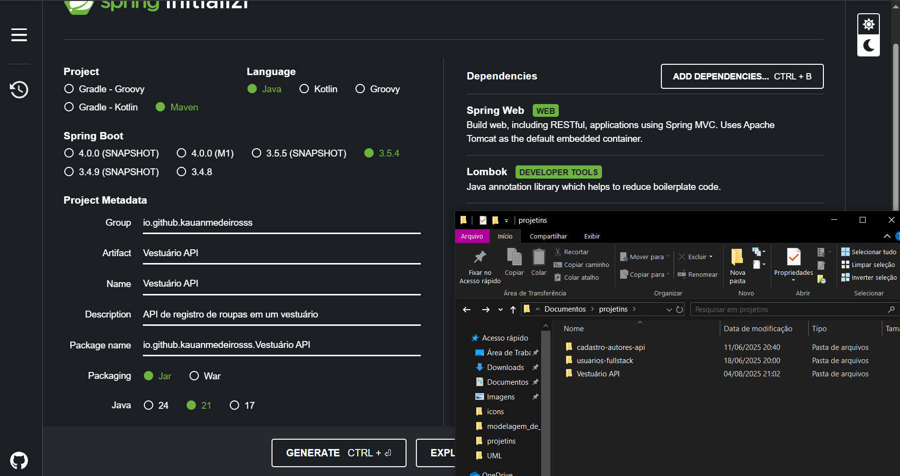

# 1. Inicialização do projeto
* Como foi configurado no spring initialzr:
    - spring web
    - Lombok
  
* Como ficou o main + package:

## 1.1 Tecnologias:
* IDE: IntelliJ
* SGBD: MySQL
* Requisições: Insomnia