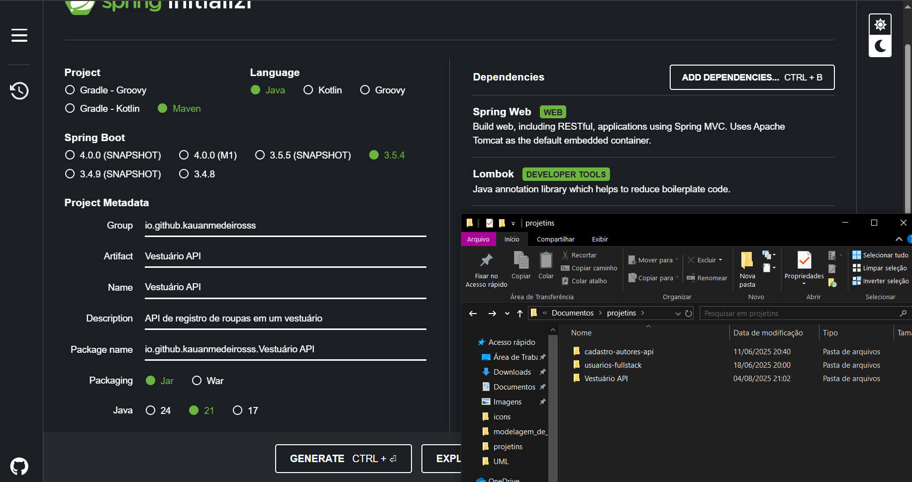
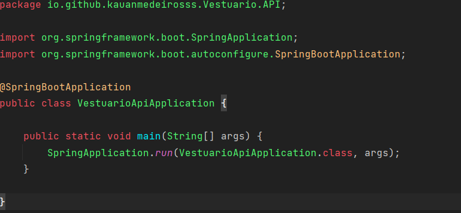
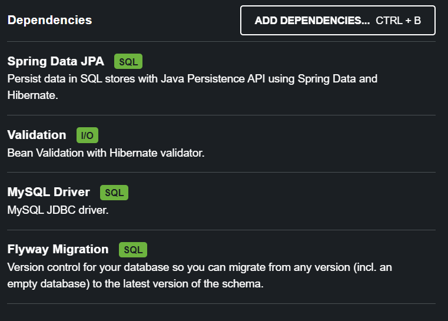

# 1. Inicialização do projeto
* Como foi configurado no spring initialzr:
    - spring web
    - Lombok
  
* Como ficou o main + package:


## 1.1 Tecnologias:
* IDE: IntelliJ
* SGBD: MySQL
* Requisições: Insomnia

## 1.2 + Depencências (e o que são)

* Spring Data JPA: Integração entre entidades e banco de dados
* Validation: Responsável pela validação dos campos da requisição e é utilizado nas classes DTO
* MySQL Driver: Responsável pela integração com o banco de dados
* Flyway Migration: Ferramenta de controle de migrações de bancos de dados

# 2. Descrição da estrutura
## 2.1 Entidade
Temos a entidade Vestimenta que tem:
* Na classe:
  - @Entity especificando seu nome, por isso singular
  - @Table especificando o nome da tabela, por isso no plural
  - as demais são do lombock, que cria de forma automátizada getters, setters e afins
* Nos atributos:
  - @Id indica que é o atributo identificador (chave primária) da classe
  - @GeneratedValue especifica que o banco irá criar o id automaticamente, com especificação da estratégia identidade, que cria ids de forma sequencial
  - @Enumerated especificando que o enum é tipo String

## 2.2 Repository
Não foi feito um service, o repository está sendo injetado diretamente no controller via @Autowired

## 2.3 DTO
* CadastrarVestimentaDTO: recebe todos os dados com exceção do Id  
  Seu mapeamento foi feito via construtor presente na própria entidade Vestimenta  
  Está de acordo com regras de negócio usando validation
* RetornarVestimentaDTO: retorna apenas alguns dados da vestimenta  
  Seu mapeamento foi feito via construtor presente na própria classe do DTO  
* AtualizarVestimentaDTO: recebe apenas alguns dados, pensando na regra de négocio, id é obrigatório para identificar, já o preço é em caso de desconto, enquanto o tamanho é em caso de troca  
  Seu mapeamento foi feito através de um método na entidade Vestimenta, o método verifica se os dados a serem alterados estão presentes
* DetalhamentoVestimentaDTO: retorna todos os dados de vestimenta, é um detalhamento completo  
  Seu mapeamento foi feito via construtor presente na própria classe do DTO

## 2.4 Controller
* Está injetando o repository via autowired
* Seus métodos POST e PUT contam com parâmetro de recebimento marcado com @Valid para passar por verificação usando validation
* Conta com @Transactional, que reverte uma transação em caso de erro, evitando perdas de dados (apenas para métodos que alteram dados)

# 3. Migrations
Para realizar controle do banco de dados será usado o Flyway, ferramenta de versionamento de banco de dados.  
O flyway precisa estar em um diretório específico, ele está em src/main/resources/db/migration  
* OBS: a estrutura do arquivo flyway é sempre a mesma V1 (v de versão e 1 é apenas um exemplo), 2 underscores (__) e o nome do comando que será executado

### 3.1 V1
Criou a tabela 'vestimentas', bem como suas colunas e definição de sua chave primária.
### 3.2 V2
Adição da coluna 'ativa' na table vestimentas, para fins de implementação da exclusão lógica. Foi também definido que todos estão ativos, para iniciar o atributo sem erros.

# 4. Funcionalidades
## 4.1 CRUD
* (C)reate: Cria/Cadastra uma vestimenta.
  - POST
  - Response sucesso: 201 Created
  - http://localhost:8080/vestimentas
  - Exemplo de body (JSON):
    ````JSON
    {
      "nome":"Shorts Casual Estampada Conquista Eterna Masculina",
      "cor":"preto",
      "tamanho":"P",
      "tipo":"SHORT",
      "loja":"Fashion Icon Clothing",
      "preco":82.99
    }
    ````
* (R)ead: Lista vestimentas. Por regra de negócio, chama apenas vestimentas que constam como ativas (atributo ativa = true).
  - GET
  - Response sucesso: 200 OK
  - http://localhost:8080/vestimentas
* (U)pdate: Atualiza apenas tamanho (em caso de troca) e preço (em caso de desconto), ambos são opcionais, podendo a requisição ter apenas um ou ambos.
  - PUT
  - Response sucesso: 200 OK
  - http://localhost:8080/vestimentas
  - Exemplo de body (JSON): 
    ````JSON
    {
	     "id":1,
	     "tamanho":"PP"
    }
    ````
* (D)elete: Deleta vestimenta por id.
  - DELETE
  - Response sucesso: 204 No Content
  - http://localhost:8080/vestimentas/{id}

## 4.2 Delete e Exclusão Lógica
Quando se deleta um arquivo em bancos relacionais, uma tabela pode ter ligação com outra tabela (ex: um produto ter ligação com um cliente), quando se tem esse tipo de relacionamento e tentamos deletar algo que está linkado a outro, temos um erro de constraint.  
Pensando nisso existem 2 tipos de exclusão:
* Exclusão de fato: vai apagar o registro completamente do banco de dados.
  - Representado no projeto pelo DELETE por id do nosso CRUD.
* Exclusão lógica: exclusão na qual implementamos um atributo "ativo" do tipo boolean, onde true indica que poderemos acessar o mesmo e false indica que não será acessado (ele existirá no sistema mas não dará resultados).
  - Representado no projeto pelo atributo boolean 'ativo', presente no model 'vestimenta'. Está também presente como a requisição 'Inativar'

## 4.3 Outras Requisições
* Inativar: Exclusão lógica de uma vestimenta. Troca seu status 'ativa' para false, que influencia na sua aparição em pesquisas.
  - DELETE
  - Response sucesso: 204 No Content
  - http://localhost:8080/vestimentas/inativar/{id}

* Ativar: Desfaz a exclusão lógica de uma vestimenta. Troca seu status 'ativa' para true, que influencia na sua aparição em pesquisas.
  - PUT
  - Response sucesso: 204 No Content
  - http://localhost:8080/vestimentas/ativar/{id}

* Buscar: Retorna o detalhamento de uma vestimenta por id.
  - GET
  - Response sucesso: 200 OK
  - http://localhost:8080/vestimentas/{id}